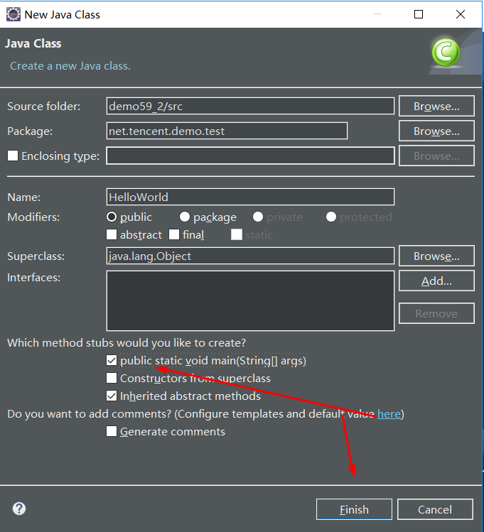
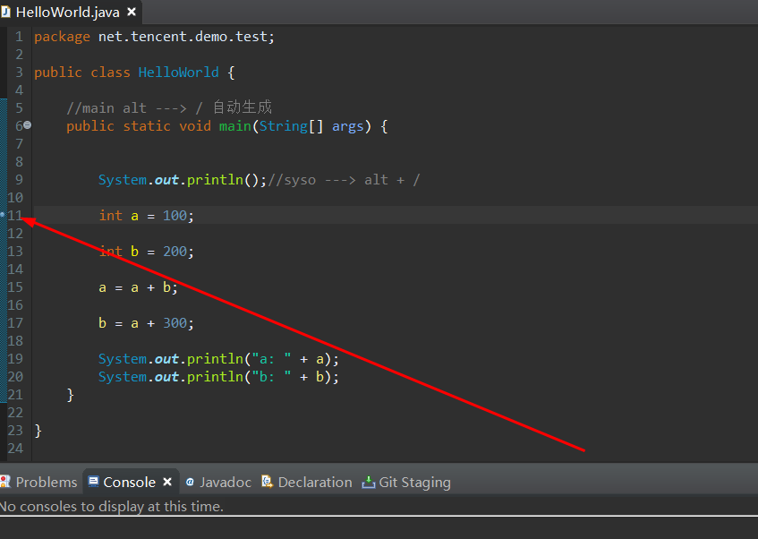
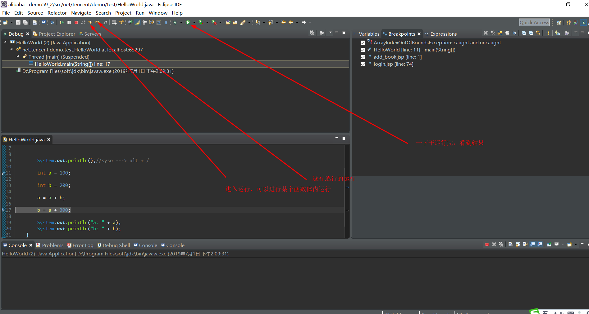
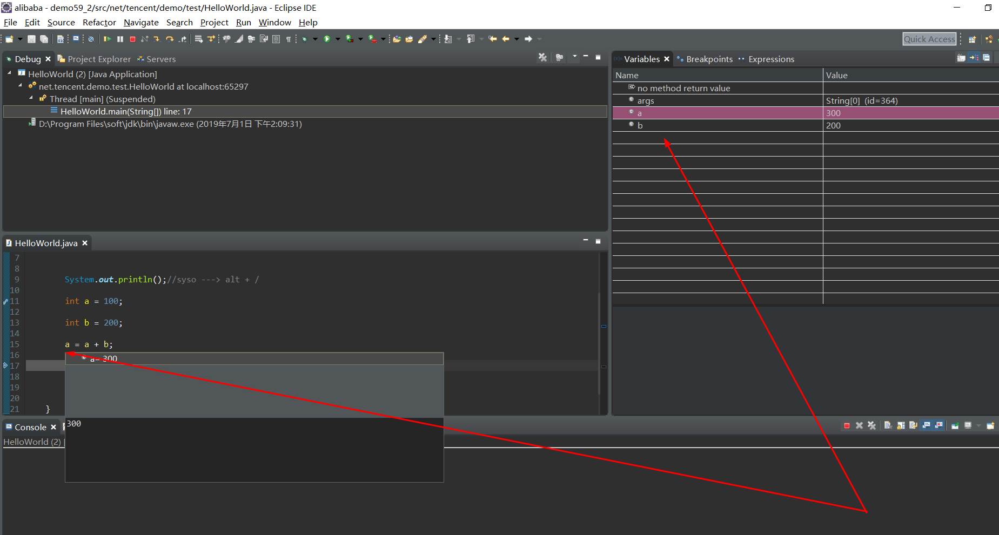
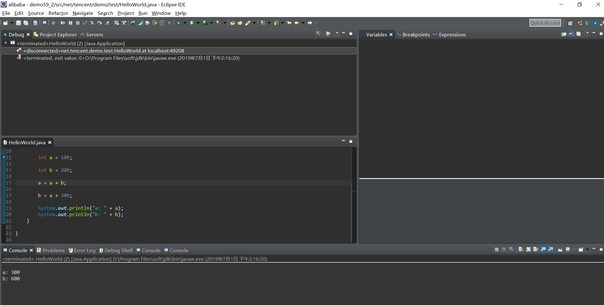
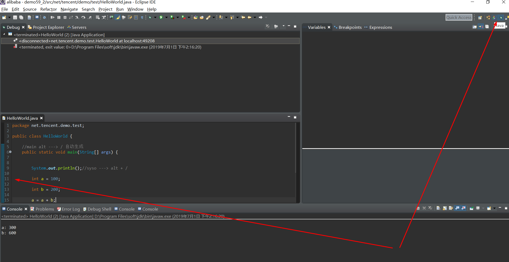
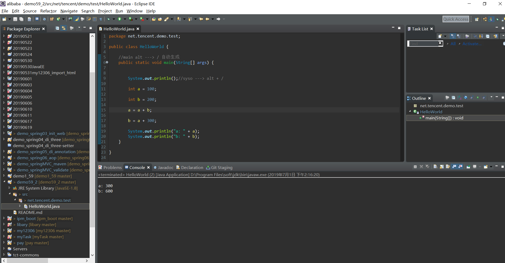

21-Eclipse如何使用debug功能？.md

1. 新建一个Java Project

2. 新建一个class




3. 写出需要调试的demo代码

```
package net.tencent.demo.test;

public class HelloWorld {

	//main alt ---> / 自动生成
	public static void main(String[] args) {
		

		System.out.println();//syso ---> alt + /
		
		int a = 100;
		
		int b = 200;
		
		a = a + b;
		
		b = a + 300;
		
		System.out.println("a: " + a);
		System.out.println("b: " + b);
	}

}
```

4. 在需要调式的行处双击 



5. 右键 ---> Debug As ---> 1 Java  Application 





+ 一步一步的最终运行完成



6. 运行完成之后双击之前断点的行数取消断点，并且恢复为非debug模式






**以就就是我关于 *Eclipse如何使用debug功能?*    知识点的整理与总结的全部内容，[另附源码](https://github.com/javaobjects/demo59_2)**

==================================================================
#### 分割线
==================================================================

**博主为咯学编程：父母不同意学编程，现已断绝关系;恋人不同意学编程，现已分手;亲戚不同意学编程，现已断绝来往;老板不同意学编程,现已失业三十年。。。。。。如果此博文有帮到你欢迎打赏，金额不限。。。**

 